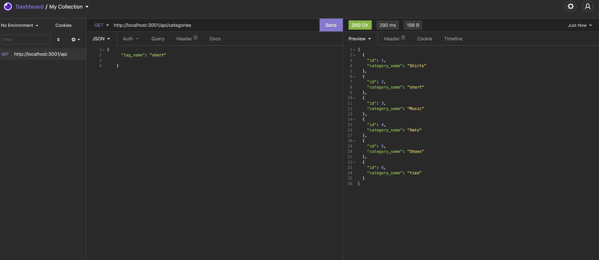

 

  # Title: E-commerce-Back-End

    
  
  ## Description: The Ecommerce back end is a demonstration of a nodejs program that encoperates express.js API to use Sequelize that interacts with a MYSQL database. THe database contains seeded inventory of a multitude of items, categories and instock data such as name category price ect.. The API routes demonstrated in this API will review all individual items, along with modifying adding and deleting items.

  ## Usage:  First the user will launch the program using node server.js then the user will use a program like postman or insomnia to run particular api Routes. The routes will demonstrate adding modifying and removing items categories and tags. The insomnia program will display the correct output in json format in response to each command.

  ## Questions: johndesgarennes@gmail.com

  ## Github username: jdesgarennes

  ## License type: MIT

  